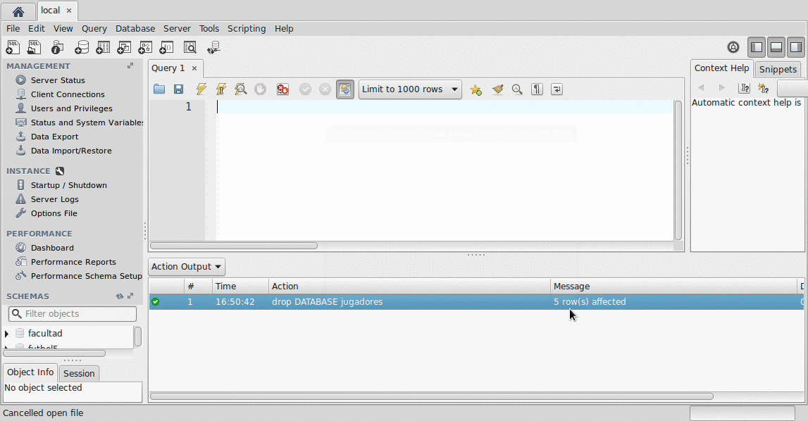
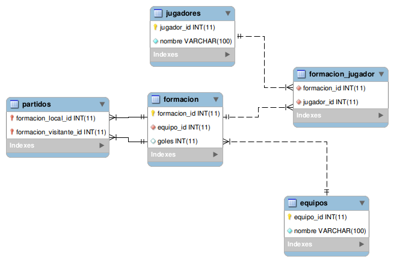

# Equipos de fútbol

[](https://travis-ci.org/uqbar-project/eg-equipos-futbol-jdbc-xtend) [](https://coveralls.io/github/uqbar-project/eg-equipos-futbol-jdbc-xtend?branch=master&service=github&refresh=true)

## Prerrequisitos

Necesitás instalar un motor de base de datos relacional (te recomendamos [MySQL](https://www.mysql.com/) que es OpenSource y gratuito)

## Objetivo

Testea el mapeo del ejercicio de los partidos de fútbol de la guía utilizando [JDBC](http://www.oracle.com/technetwork/java/javase/jdbc/index.html)

* En MySQL: tenés que correr los scripts que están en el directorio [scripts](scripts/) en el orden en que están (01, 02, etc.)




* Importá el proyecto Xtend como proyecto Maven
* Entrá a la clase RepoJDBCPartidos y cambiá la contraseña de root de tu base: 
 
``` java
 static final String USER = "root"
 static final String PASS = "xxxx"
```

## Diagrama Entidad-Relación


